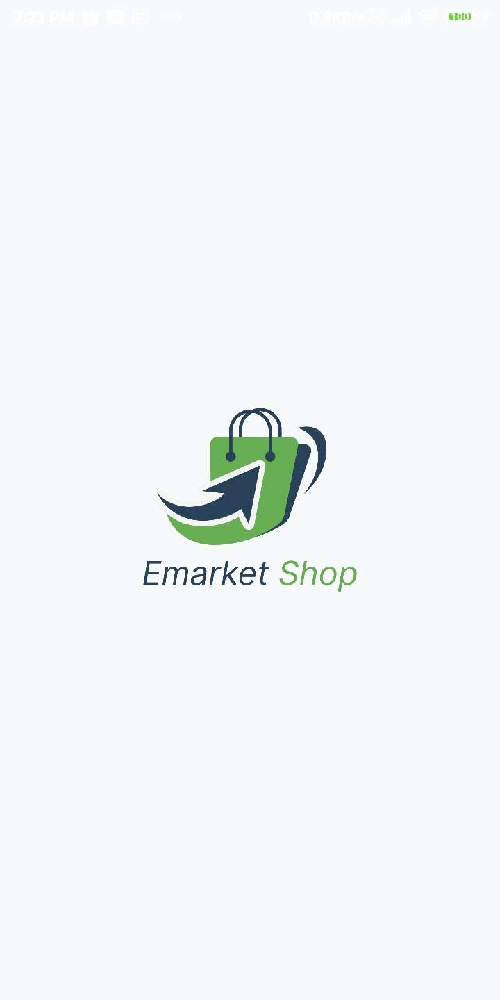
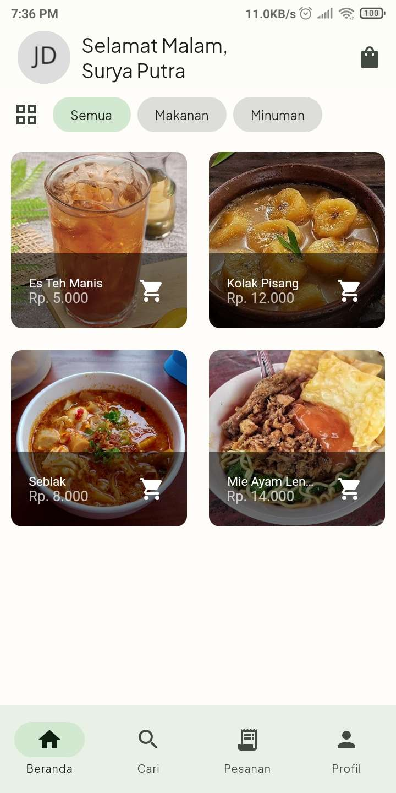
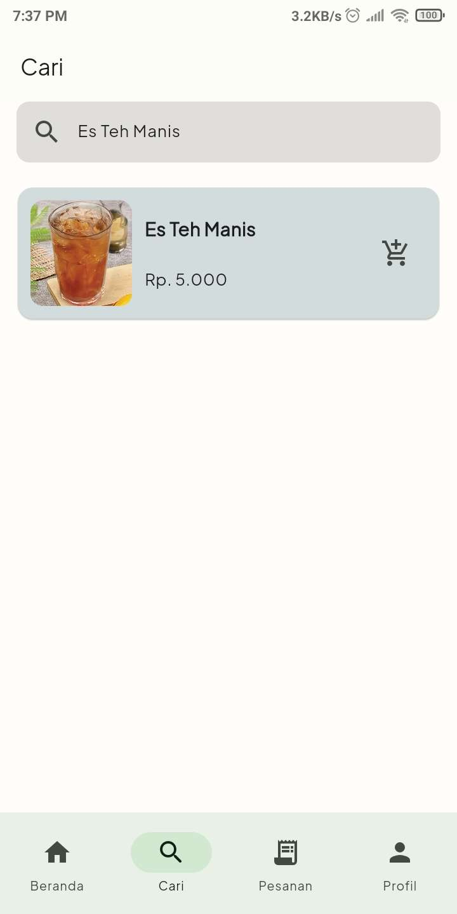
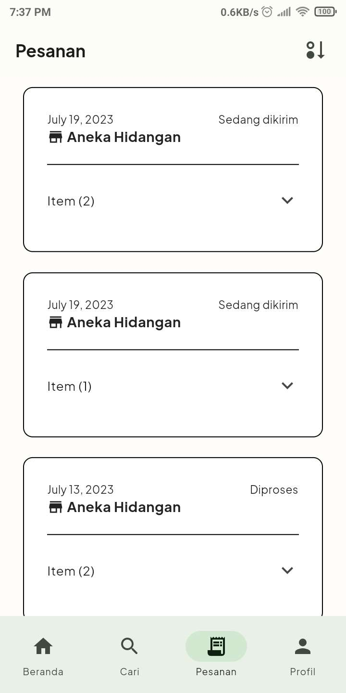
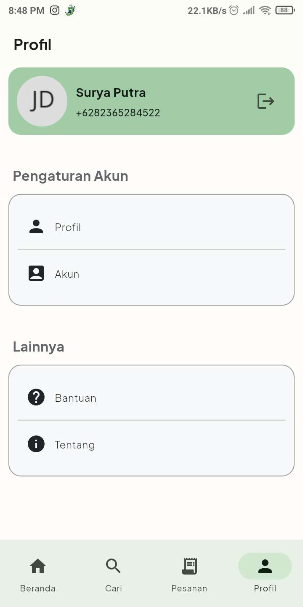
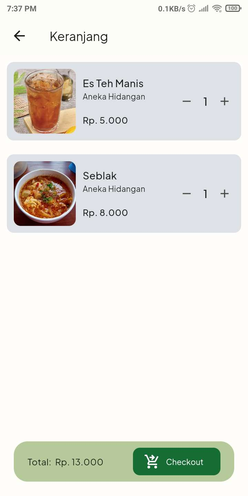
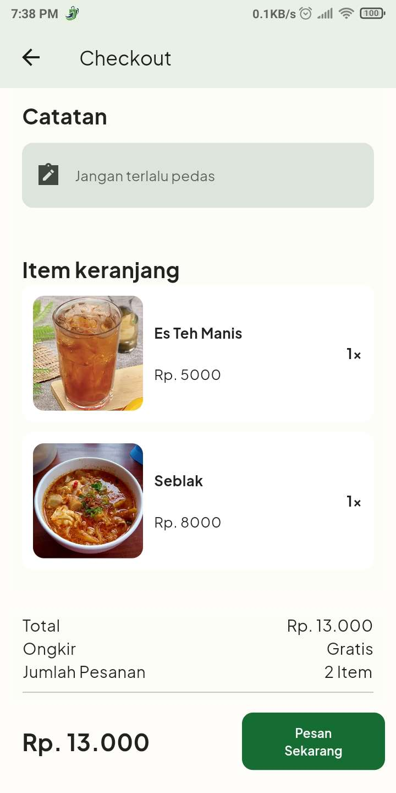
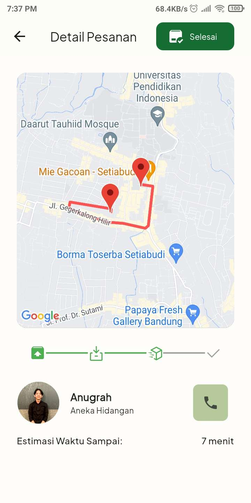

# E-Market Project
This is a Flutter project developed as a thesis to fulfill the graduation requirements for a Bachelor's degree in Informatics Engineering at Universitas Pasundan (Pasundan University). There are two applications in this project, namely the [E-Market Seller application](https://github.com/anugrahsputra/emarket-seller.git) and the [E-Market Buyer application.](https://github.com/anugrahsputra/emarket-buyer.git)

## E-Market Buyer Application

The E-Market Buyer mobile application is designed for buyers who want to purchase products online from the E-Market platform. This application caters to the needs of people residing in Kecamatan Malingping.

## Target Users: People in Kecamatan Malingping
The E-Market Buyer mobile application aims to provide a convenient platform for buyers in Kecamatan Malingping to browse and purchase products online. By focusing on this specific user group, the application takes into account the unique preferences and requirements of buyers in Kecamatan Malingping, offering tailored features and functionalities to enhance their shopping experience.

## Features
- Authentication
    - [x] Login
    - [x] Register
    - [ ] Forgot Password
    - [ ] Email Verification
    - [ ] Phone Verification
- Browse Available Products
    - [x] List view
    - [x] Grid view
    - [x] Filter products by categories
    - [x] Search Products
    - [x] Detail Products
    - [x] Add Product to cart
- Purchasing Products
    - [x] Checkout Information Detail
    - [x] Order History
    - [x] Delivery Tracking


## Technologies

- [Firebase](https://firebase.google.com/)
    - [Authentication](https://firebase.google.com/docs/auth)
    - [Cloud Firestore](https://firebase.google.com/docs/firestore)
    - [Cloud Storage](https://firebase.google.com/docs/storage)
    - [Cloud Messaging](https://firebase.google.com/docs/cloud-messaging)

- [Google Maps](https://developers.google.com/maps/documentation)
    - [Geocoding API](https://developers.google.com/maps/documentation/geocoding/overview)
    - [Places API](https://developers.google.com/maps/documentation/places/web-service/overview)
    - [Maps SDK for Android](https://developers.google.com/maps/documentation/android-sdk/overview)
    - [Directions API](https://developers.google.com/maps/documentation/directions/overview)
    - [Distance Matrix API](https://developers.google.com/maps/documentation/distance-matrix/overview)

- [State Management](https://flutter.dev/docs/development/data-and-backend/state-mgmt)
    - [GetX](https://pub.dev/packages/get)


## Packages

You can see the packages used in this project inside the file [pubspec.yaml](pubspec.yaml).

## Screenshots
<p align="center">
    
    
    
    
    
    
    
    
    
</p>


## Installation and Usage

To try the app, you can clone this repository and run it on your local machine:
```
$ git clone https://github.com/anugrahsputra/emarket-buyer.git
$ cd emarket-buyer
```
Get all the dependencies:
```
$ flutter pub get
```

### Notes 🗒️
- The E-Market Buyers application does not have payment gateway integration. This decision is based on the understanding that most UMKM businesses in Kecamatan Malingping do not have the resources to support online payment transactions. Instead, the application allows buyers to place orders and arrange payment and delivery details directly with the sellers.

- ##### All the technologies that are used in this project using the paid version. So, if you want to try this app, you need to create your own project in Firebase and Google Cloud Platform and replace the API keys with your own API keys.